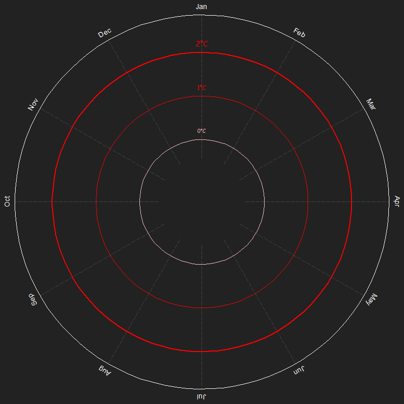
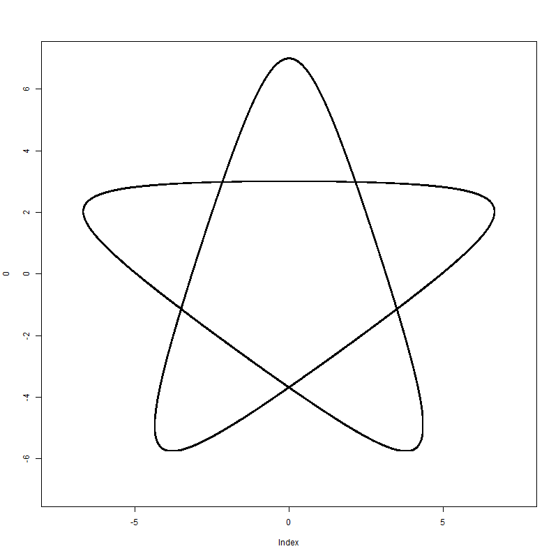
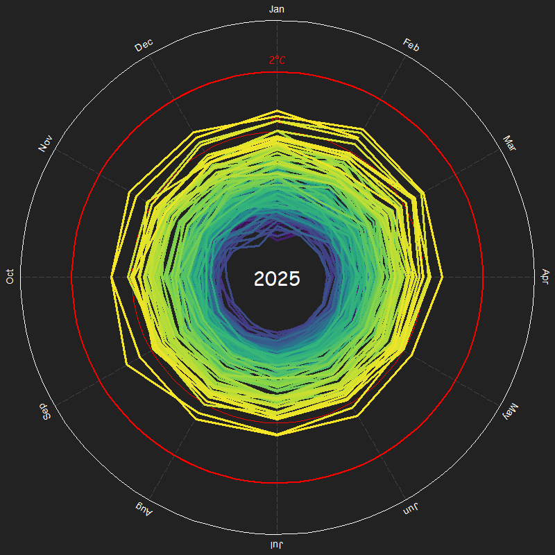

# Motivation

The climate spiral is a very popular graph used to showcase global
warming effects on the global average of temperatures, it creates a good
contrast to a time series plot by making it easier to understand by
everyone (also because it’s beautiful).

Everyone got assigned a pair and got this as homework (it was more than
just the graph), and i volunteered to do the graph part all by myself.

But there’s a catch, i challenged myself to do it all in base R, sadly,
i couldn’t avoid using gifski and cols4all.

### Sources

Here’s where i got the [Data](https://data.giss.nasa.gov/gistemp/), and
these were the references used [Nasa’s graph (with
3d)](https://svs.gsfc.nasa.gov/5190/) and [Ed Hawking’s
graphs](https://www.climate-lab-book.ac.uk/spirals/). I used the same
color pallete as Ed Hawking, i think viridis looked perfect on this type
of graph.

# Setting up variables

### data

Just opening it, skipping the header and then ignoring the years column.

After that i transformed every temperature into a radius with this
function.

$r(t)=0.5+0.35t$

``` r
dados <- read.csv("Temperatura.csv",sep=",",header=T,skip=1)
Temp.mensal <- dados[,2:13]
Temp <- as.matrix(Temp.mensal)
#as.double() is making Temp a vector, so i had to transform back to a matrix
Temp <- matrix(as.double(Temp),ncol=12)
radius <- 0.5 + 0.35*Temp
```

### constants

- angles: sets up all the angles (in radians) for where the months will
  be placed

- rotation: sets up all the angles (in degrees for some reason) of how
  much the text of each month will rotate

- months: all the months

- col.viridis: gets 146 equally spaced colors in the viridis pallete

``` r
angles <- seq(from=pi/2,to=-3*pi/2,length.out=13)[-13]
rotation <- seq(from=0,to=360,length.out=13)[-13]
months <- c("Jan","Feb","Mar","Apr","May","Jun","Jul","Aug","Sep","Oct","Nov","Dec")
col.viridis <- c4a("viridis",146)
```

# Plot functions

### circle

There was no function in base R that draws circles, so i made a function
that draws any parametric curve.

- it gets “precision” points within that curve and connect them with
  lines.

- it needs “funct” to be a list with 2 functions in it, and they need to
  be called x and y.

``` r
parametric.draw <- function(range,funct,precision=100,...)
{
  points <- seq(from=range[1],to=range[2],length.out=precision)
  coords <- list(x = funct$x(points), y = funct$y(points))
  lines(coords$x,coords$y,...)
}
```

just for fun (and also to show it works), i’ll plot this curve i found
by googling “cool parametric curves”.

t is the parameter ranging from 0 to 6$\pi$, and $\theta$ is for extra
rotations (i added a 2$\pi$ rotation because the star was upside down).

$$
\large \boxed{x(t)=2cos(t +\theta)+5sin(\frac{2t}{3}+\theta),y(t)=2sin(t +\theta)+5cos(\frac{2t}{3}+\theta)}
$$



### base plot


- i start by changing graphical parameters to have no margin and to make
  the background a grayish color and then i create an empty plot.

- circle receives a function that gets the radius, and outputs the list
  used in parametric.draw() for a circle with that radius.

- then i set up the text for the months around the circle.

- and also set up dashed lines that come from approximately from the
  center all the way to each month (for aesthetical reasons).

- after all that i just draw all the circles and add some texts to
  indicate which temperature represent which circle. This part was all
  done by hand, checking multiple times to find a value that seems
  great, every number that feels random is actually just a lot of trial
  and error.

``` r
plot.base <- function()
{
  par(bg="#222222",mar=rep(0, 4))
  plot(0,type="n",ann=F,axes=F,xlim=c(-1.5,1.5),ylim=c(-1.5,1.5),asp=1)
  circle <- function(r) list(x = function(t) r*cos(t), y = function(t) r*sin(t))
  
  for(i in 1:12)
  {
    text(1.57*cos(angles[i]),1.57*sin(angles[i]),months[i],col="white",srt= -rotation[i],cex=1.15)
    lines(x=c(0.35*cos(angles[i]),1.5*cos(angles[i])),y=c(0.35*sin(angles[i]),1.5*sin(angles[i])),lwd=0.01,lty=5,col="#444444")
  }  

  parametric.draw(range = c(0,2*pi),funct = circle(1.20),col="red",lwd=2.75)
  text(0,1.275,"2°C",col="red",cex=1.15,family="C")
  parametric.draw(range = c(0,2*pi),funct = circle(0.85),col="red",lwd=1.75)
  text(0,0.925,"1°C",col="red",cex=1,family="C")
  parametric.draw(range = c(0,2*pi),funct = circle(0.5),col="pink",lwd=1.25)
  text(0,0.575,"0°C",col="pink",cex=0.85,family="C")
  parametric.draw(range = c(0,2*pi),funct = circle(1.5),col="white",lwd=1)
}
```

### plotting each frame



- it starts by plotting the base,then it goes to some weird math to
  calculate every position in the data matrix.

- the math for the collumns works like this: imagine you want x%%12 but
  when x is a multiple of 12 you NEED x%%12 to equal 12, and after a
  bunch of math, 12 - (-x)%12 gives exactly what i want.

- col and col.2 are there to find the coordinates for the lines i’ll
  draw, i need to calculate both the one i’m in and the next, but there
  would be a problem when i’m in december and i try to access the 13th
  position, that’s why i need the col.2.

- the math behind the rows positions isnt that complicated, it just is
  the integer part of the division by 12 (there’s a +1 thrown in there
  because indices start at 1, and not 0).

- because it’s in a for loop, this draws lines on every pair of
  coordinates up to “frame_number”.

- the matrix “coordin” is just the matrix of radius for each month.

- it ends by writing in the center of the screen what year is it
  (family=“C” is just comic sans).

``` r
plot_frame <- function(frame_number,coordin) { 
    
    plot.base()
    
    for(i in 1:frame_number)
    {
    col <- 12 - (-i)%%12
    col.2 <- 12 - (-(i+1))%%12
    
    row <- floor((i-1)/12) + 1
    row.2 <- floor(i/12) +1
    
    
    lines(x=c(coordin[row,col]*cos(angles[col]),coordin[row.2,col.2]*cos(angles[col.2])),
          y=c(coordin[row,col]*sin(angles[col]),coordin[row.2,col.2]*sin(angles[col.2])),col=col.viridis[row.2],lwd=3)
    }
    text(0,0,c(1880:2025)[floor((frame_number-1)/12)+1],col="white",cex=2.3,family="C")
} 
```

# animating

there’s a function taking care of everything, where n is the total
number of data in the matrix, frames is the amount of frames we want in
the main animation and spf is the delay between frames (seconds per
frame).

### animation function

- this function is the only one taking care of the parameters resetting
  to whatever you were using before.

- plots the base for 1 second (1/spf = fps)

- divides the main animation in “frames” amount of equal frames, and
  plots each

- plots the last frame for 3 seconds

``` r
animation <- function(n=1750,frames,spf)
{
  op <- par(no.readonly = T)
  par(bg="#222222",mar=rep(0, 4))
  
  for(i in 1:ceiling(1/spf))
  plot.base()
  
  for(j in 1:frames)
  {
    plot_frame(floor(j*n/frames),radius)
  }
  
  for(k in 1:ceiling(3/spf))
    plot_frame(n,radius)
  
  par(op)
}
```

### gifski part

not too much to comment on this, gifski is not that hard to use.

``` r
save_gif(
  animation(n=1750,frames=12*6,spf=1/12),
  gif_file = "Fast.gif",
  width = 800,
  height = 800,
  delay = 1/12,
  loop = TRUE,
  progress = TRUE)
```

- 12fps with 6 seconds in the main animation and 10 seconds in total


